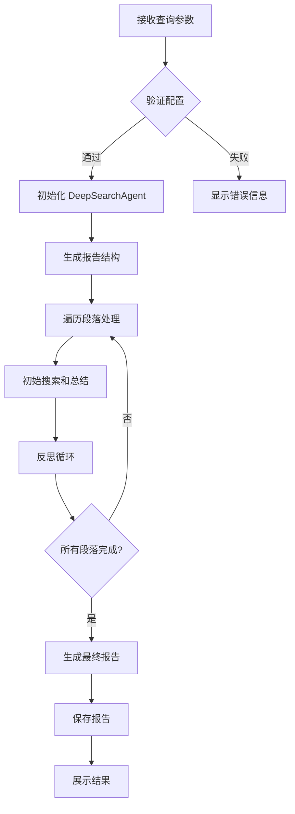
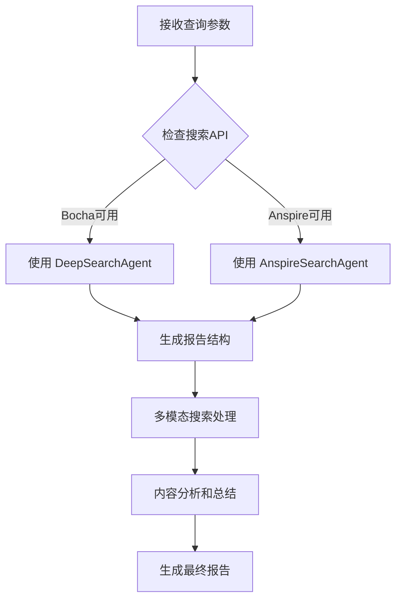
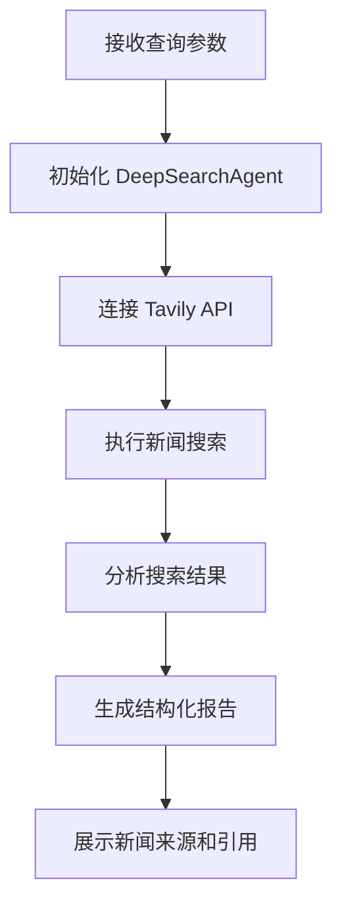

# SingleEngineApp - 单一引擎 Streamlit 应用

**面包屑导航**: [首页](../CLAUDE.md) / SingleEngineApp

## 📋 模块概述

SingleEngineApp 包含三个独立的 Streamlit Web 应用，每个应用对应一个核心引擎的 Web 界面。这些应用提供了用户友好的界面来使用各个引擎的功能，支持通过 URL 参数进行自动化查询和搜索。

## 🎯 核心功能

### 1. **统一界面模式**
- 三个应用采用相同的界面结构和交互模式
- 支持从主页面通过 URL 参数传递查询内容
- 自动化搜索执行模式
- 实时进度显示和结果展示

### 2. **独立部署能力**
- 每个应用都可以独立运行
- 使用不同的端口号（8501-8503）
- 支持通过 Flask 主应用统一管理

### 3. **配置灵活性**
- 支持硬编码和配置文件两种配置方式
- 环境变量自动读取
- 模型配置可自定义

## 📁 文件结构

```
SingleEngineApp/
├── insight_engine_streamlit_app.py    # 洞察引擎 Web 界面
├── media_engine_streamlit_app.py      # 媒体引擎 Web 界面
└── query_engine_streamlit_app.py      # 查询引擎 Web 界面
```

## 🔧 各引擎详细说明

### 1. Insight Engine Streamlit App

**文件**: `insight_engine_streamlit_app.py`

**功能特点**:
- 使用 Kimi 模型 (kimi-k2-0711-preview) 作为默认 LLM
- 支持长文本处理 (最大 500,000 字符)
- 连接私有舆情数据库
- 支持多轮搜索和反思循环

**执行流程**:


**关键配置**:
```python
# 模型配置
model_name = "kimi-k2-0711-preview"
max_reflections = 2
max_content_length = 500000

# 数据库配置
DB_HOST, DB_USER, DB_PASSWORD, DB_NAME
DB_PORT, DB_CHARSET, DB_DIALECT
```

**使用方式**:
```
http://localhost:8501/?query=<查询内容>&auto_search=true
```

### 2. Media Engine Streamlit App

**文件**: `media_engine_streamlit_app.py`

**功能特点**:
- 使用 Gemini 模型 (gemini-2.5-pro) 作为默认 LLM
- 支持多模态内容处理（视频、图文、直播）
- 集成 Bocha 和 Anspire 搜索 API
- 支持抖音、快手、小红书等平台

**执行流程**:


**关键配置**:
```python
# 模型配置
model_name = "gemini-2.5-pro"
max_reflections = 2
max_content_length = 20000

# 搜索API配置
BOCHA_WEB_SEARCH_API_KEY  # Bocha API
ANSPIRE_API_KEY           # Anspire API
```

**特殊功能**:
- 自动选择可用的搜索 API
- 支持结构化信息（日历卡、天气卡、股票卡）
- 展示搜索工具和段落标题

### 3. Query Engine Streamlit App

**文件**: `query_engine_streamlit_app.py`

**功能特点**:
- 使用 DeepSeek 模型 (deepseek-chat) 作为默认 LLM
- 基于 Tavily 新闻搜索 API
- 专注于国内外官方报道和新闻
- 注重舆情广度分析

**执行流程**:


**关键配置**:
```python
# 模型配置
model_name = "deepseek-chat"
max_reflections = 2
max_content_length = 20000

# 搜索API配置
TAVILY_API_KEY  # Tavily API 密钥
```

## 🚀 与主应用的集成

### Flask 主应用管理

在 `app.py` 中，这三个 Streamlit 应用通过以下方式管理：

```python
# 进程配置
processes = {
    'insight': {'process': None, 'port': 8501, 'status': 'stopped'},
    'media': {'process': None, 'port': 8502, 'status': 'stopped'},
    'query': {'process': None, 'port': 8503, 'status': 'stopped'}
}

# 脚本路径
STREAMLIT_SCRIPTS = {
    'insight': 'SingleEngineApp/insight_engine_streamlit_app.py',
    'media': 'SingleEngineApp/media_engine_streamlit_app.py',
    'query': 'SingleEngineApp/query_engine_streamlit_app.py'
}
```

### 启动命令示例

```bash
# 启动洞察引擎
streamlit run SingleEngineApp/insight_engine_streamlit_app.py --server.port 8501

# 启动媒体引擎
streamlit run SingleEngineApp/media_engine_streamlit_app.py --server.port 8502

# 启动查询引擎
streamlit run SingleEngineApp/query_engine_streamlit_app.py --server.port 8503
```

## 🔗 URL 参数规范

所有三个应用都支持以下 URL 参数：

| 参数 | 类型 | 说明 | 示例 |
|-----|------|------|------|
| query | string | 查询内容（需要 URL 编码） | `query=AI发展趋势` |
| auto_search | boolean | 是否自动执行搜索 | `auto_search=true` |

完整 URL 示例：
```
http://localhost:8501/?query=人工智能在医疗领域的应用&auto_search=true
```

## 📊 结果展示功能

### 共同的展示组件

1. **研究小结标签页**
   - 显示 Markdown 格式的最终报告
   - 支持完整的 HTML 渲染

2. **引用信息标签页**
   - 段落详情（预期内容 vs 最终内容）
   - 搜索次数和反思次数统计
   - 搜索历史（URL、标题、内容预览、相关度评分）

### Media Engine 特有展示

- 使用的搜索工具标识
- 段落标题显示
- 搜索结果状态（成功/失败）

## ⚙️ 配置管理

### 环境变量优先级

1. 硬编码默认值（代码中指定）
2. 环境变量（.env 文件或系统环境）
3. URL 参数（仅查询内容）

### 关键环境变量

```env
# Insight Engine
INSIGHT_ENGINE_API_KEY=
INSIGHT_ENGINE_BASE_URL=
INSIGHT_ENGINE_MODEL_NAME=

# Media Engine
MEDIA_ENGINE_API_KEY=
MEDIA_ENGINE_BASE_URL=
MEDIA_ENGINE_MODEL_NAME=
BOCHA_WEB_SEARCH_API_KEY=
ANSPIRE_API_KEY=

# Query Engine
QUERY_ENGINE_API_KEY=
QUERY_ENGINE_BASE_URL=
QUERY_ENGINE_MODEL_NAME=
TAVILY_API_KEY=

# 数据库配置
DB_HOST=
DB_USER=
DB_PASSWORD=
DB_NAME=
DB_PORT=
DB_CHARSET=
DB_DIALECT=
```

## 🐛 错误处理

### 统一的错误处理机制

所有应用都使用 `error_with_issue_link` 函数处理错误：

```python
error_display = error_with_issue_link(
    f"研究过程中发生错误: {str(e)}",
    error_traceback,
    app_name="Engine Name Streamlit App"
)
st.error(error_display)
```

### 常见错误类型

1. **API 密钥未配置** - 提示用户设置相应的环境变量
2. **查询内容为空** - 提示用户输入有效的查询
3. **搜索 API 不可用** - Media Engine 特有，提示检查 API 配置
4. **数据库连接失败** - Insight Engine 特有，提示检查数据库配置

## 🔄 执行流程共性

### 标准执行步骤

1. **初始化阶段**
   - 解析 URL 参数
   - 验证配置和 API 密钥
   - 创建 Settings 配置对象

2. **执行阶段**
   - 初始化 Agent
   - 生成报告结构（20% 进度）
   - 逐个处理段落（20-80% 进度）
   - 生成最终报告（90% 进度）
   - 保存报告（100% 进度）

3. **展示阶段**
   - 显示研究小结
   - 展示引用信息和搜索历史

### 进度条实现

```python
progress_bar = st.progress(0)
status_text = st.empty()

# 更新进度
progress_bar.progress(value)
status_text.text("当前状态描述")
```

## 📝 日志管理

所有应用的输出都会：
1. 显示在 Streamlit 界面上
2. 写入对应的日志文件（`logs/{app_name}.log`）
3. 通过 WebSocket 推送到主应用控制台

## 🧪 测试建议

### 本地测试

```bash
# 测试单个应用
streamlit run SingleEngineApp/insight_engine_streamlit_app.py

# 带参数测试
streamlit run SingleEngineApp/media_engine_streamlit_app.py -- \
    --query "测试查询" --auto_search true
```

### 集成测试

通过主应用启动并测试：
1. 访问主页面
2. 输入查询内容
3. 选择对应的引擎
4. 观察自动跳转和执行

## 💡 最佳实践

1. **URL 编码**：查询内容必须进行 URL 编码
2. **配置管理**：使用 .env 文件管理敏感信息
3. **错误监控**：关注日志文件中的错误信息
4. **资源管理**：及时停止不使用的应用进程
5. **性能优化**：根据需要调整 `max_content_length` 和 `max_reflections`

## 🔮 扩展建议

1. **增加更多展示选项**：如导出 PDF、分享链接等
2. **优化移动端体验**：响应式布局优化
3. **添加历史记录**：保存和查看历史查询
4. **批量处理**：支持多个查询的批量执行
5. **实时协作**：多用户同时查看结果

---

**最后更新**: 2025-12-08 15:52:05
**文档签名**: ssiagu