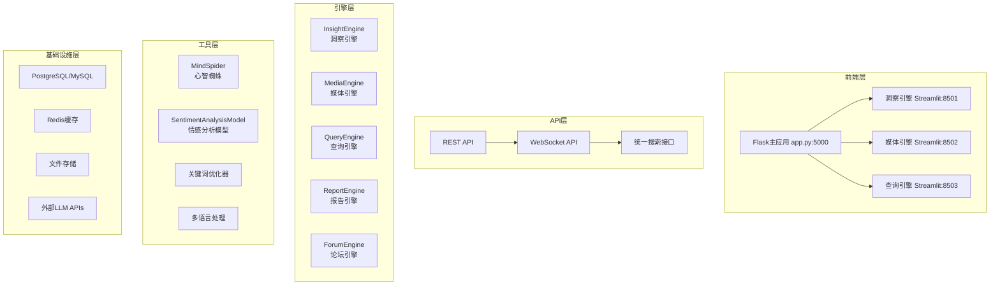
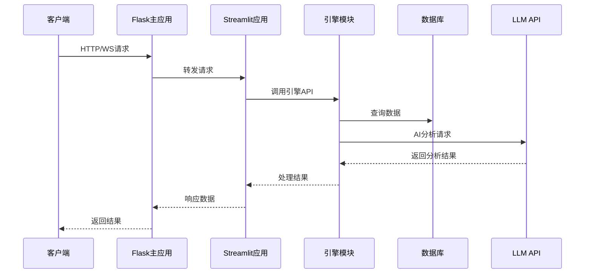

# BettaFish 项目架构和执行流程分析

### 一、系统架构概述

BettaFish是一个基于**多智能体架构**的微博舆情分析系统，采用**微服务架构设计**，各引擎模块独立运作又相互配合。

#### 1.1 技术栈
- **后端**: Python 3.11, Flask (主应用), Streamlit (各引擎UI)
- **数据库**: PostgreSQL/MySQL (媒体数据存储)
- **缓存**: Redis (可选)
- **AI/LLM**: 支持多种LLM API (OpenAI, Kimi, Gemini, DeepSeek等)
- **实时通信**: Socket.IO (WebSocket)
- **部署**: Docker, Docker Compose

#### 1.2 核心架构层次



### 二、核心引擎模块详解

#### 2.1 InsightEngine (洞察引擎)
- **位置**: `InsightEngine/`
- **核心功能**: 深度搜索与智能洞察
- **主类**: `DeepSearchAgent` (agent.py:41)
- **工作流程**:
  1. `FirstSearchNode`: 执行初始搜索
  2. `FirstSummaryNode`: 生成首次总结
  3. `ReflectionNode`: 反思分析
  4. `ReflectionSummaryNode`: 生成反思总结
  5. `ReportFormattingNode`: 格式化报告
- **特色功能**:
  - 关键词自动优化 (keyword_optimizer.py)
  - 多语言情感分析 (22种语言)
  - 智能聚类算法 (SentenceTransformer)

#### 2.2 MediaEngine (媒体引擎)
- **位置**: `MediaEngine/`
- **核心功能**: 多媒体内容处理与分析
- **主类**: `MediaAgent` (agent.py)
- **特色功能**:
  - 图片/视频内容分析
  - 多模态内容理解
  - 媒体数据挖掘

#### 2.3 QueryEngine (查询引擎)
- **位置**: `QueryEngine/`
- **核心功能**: 基于Tavily的新闻搜索与信息检索
- **主类**: `QueryAgent` (agent.py)
- **特色功能**:
  - 实时新闻搜索
  - Tavily API集成
  - 信息聚合与筛选

#### 2.4 ReportEngine (报告引擎)
- **位置**: `ReportEngine/`
- **核心功能**: 智能报告生成与导出
- **主类**: `ReportAgent` (agent.py)
- **Flask接口**: `flask_interface.py`
- **渲染器**: `renderers/`
- **特色功能**:
  - 多格式报告导出 (PDF, HTML, Word)
  - 模板化报告生成
  - 数据可视化

#### 2.5 ForumEngine (论坛引擎)
- **位置**: `ForumEngine/`
- **核心功能**: 论坛监控与LLM托管
- **监控器**: `monitor.py`
- **主持人**: `llm_host.py`
- **特色功能**:
  - 实时监控各引擎日志
  - AI主持人智能引导讨论
  - 多引擎协作平台

#### 2.6 MindSpider (心智蜘蛛)
- **位置**: `MindSpider/`
- **核心功能**: 主题提取与深度情感爬取
- **子模块**:
  - `BroadTopicExtraction/`: 广泛主题提取
  - `DeepSentimentCrawling/`: 深度情感爬取
- **主程序**: `main.py`

### 三、系统执行流程

#### 3.1 启动流程
```python
# app.py 主启动流程
1. Flask应用初始化 (app.py:35)
2. SocketIO异步模式选择 (app.py:39-54)
3. ReportEngine Blueprint注册 (app.py:90-94)
4. 系统组件初始化 (initialize_system_components:286)
   - MindSpider数据库初始化
   - Streamlit子应用启动
   - ForumEngine论坛启动
   - ReportEngine初始化
5. 日志监控线程启动 (monitor_forum_log:449)
```

#### 3.2 请求处理流程


#### 3.3 搜索分析流程
1. **接收查询**: 通过统一搜索接口接收查询请求
2. **关键词优化**: 使用LLM优化搜索关键词
3. **多引擎并行**: Insight/Media/Query三引擎并行处理
4. **结果聚合**: 收集各引擎搜索结果
5. **智能分析**:
   - 情感分析 (SentimentAnalysisModel)
   - 内容聚类
   - 深度洞察生成
6. **报告生成**: ReportEngine生成最终报告
7. **实时推送**: 通过WebSocket推送结果

### 四、API接口体系

#### 4.1 REST API (app.py)
- **系统管理**:
  - `GET /api/system/status` - 获取系统状态
  - `POST /api/system/start` - 启动系统
  - `POST /api/system/shutdown` - 关闭系统
  - `GET /api/status` - 获取所有应用状态

- **应用控制**:
  - `POST /api/start/<app_name>` - 启动指定应用
  - `POST /api/stop/<app_name>` - 停止指定应用
  - `GET /api/output/<app_name>` - 获取应用输出

- **搜索与分析**:
  - `POST /api/search` - 统一搜索接口
  - `GET /api/forum/log` - 获取论坛日志
  - `POST /api/forum/log/history` - 获取历史日志

- **配置管理**:
  - `GET /api/config` - 获取配置
  - `POST /api/config` - 更新配置

#### 4.2 WebSocket API (Socket.IO)
- **连接事件**:
  - `connect` - 客户端连接
  - `request_status` - 请求状态更新
  - `console_output` - 控制台输出推送
  - `forum_message` - 论坛消息推送
  - `status_update` - 状态更新推送

#### 4.3 Streamlit API端口
- InsightEngine: 8601
- MediaEngine: 8602
- QueryEngine: 8603

### 五、数据流转机制

#### 5.1 日志系统
- **日志目录**: `logs/`
- **日志文件**:
  - `insight.log` - 洞察引擎日志
  - `media.log` - 媒体引擎日志
  - `query.log` - 查询引擎日志
  - `forum.log` - 论坛日志

#### 5.2 监控机制
ForumEngine实时监控各引擎的SummaryNode输出，提取关键信息并通过AI主持人促进讨论。

#### 5.3 状态管理
- 全局状态锁 (system_state_lock:243)
- 进程状态追踪 (processes:516)
- WebSocket实时状态同步

### 六、配置体系

#### 6.1 配置文件结构 (config.py)
- **Flask服务器配置**: HOST, PORT
- **数据库配置**: DB_DIALECT, DB_HOST, DB_PORT等
- **LLM API配置**: 各引擎的API_KEY, BASE_URL, MODEL_NAME
- **搜索工具配置**: TAVILY_API_KEY, BOCHA_API_KEY等
- **搜索限制配置**: 各类DEFAULT_*_LIMIT参数

#### 6.2 环境变量加载
- 优先级: 当前工作目录.env > 项目根目录.env
- 使用Pydantic Settings进行管理
- 支持运行时动态更新

### 七、系统特色功能

1. **多智能体协作**: 5个独立引擎协同工作
2. **实时监控论坛**: ForumEngine提供AI主持的讨论环境
3. **智能聚类分析**: 使用ML算法优化搜索结果
4. **多语言支持**: 支持22种语言的情感分析
5. **灵活的LLM集成**: 支持多种LLM API提供商
6. **完整报告系统**: 自动生成多格式分析报告

### 八、性能优化措施

1. **异步处理**: 使用gevent/eventlet提升并发性能
2. **懒加载**: 聚类模型等大模型懒加载
3. **缓存机制**: 配置缓存、搜索结果缓存
4. **资源管理**: 自动清理、超时控制
5. **并发控制**: 避免同时执行多个重任务

### 九、代码执行细节

#### 9.1 Flask应用初始化细节
```python
# app.py 核心初始化代码
app = Flask(__name__)
app.config['SECRET_KEY'] = 'Dedicated-to-creating-a-concise-and-versatile-public-opinion-analysis-platform'

# 异步模式智能选择
try:
    import gevent
    async_mode = 'gevent'
except ImportError:
    try:
        import eventlet
        async_mode = 'eventlet'
    except ImportError:
        async_mode = 'threading'

socketio = SocketIO(app, cors_allowed_origins="*", async_mode=async_mode)
```

#### 9.2 进程管理机制
- 子进程管理字典 (processes:516)
- 输出队列系统 (output_queues:545)
- 健康检查机制 (check_app_status:767)
- 优雅关闭流程 (cleanup_processes_concurrent:833)

#### 9.3 日志监控实现
```python
# ForumEngine监控目标
target_node_patterns = [
    'FirstSummaryNode',
    'ReflectionSummaryNode',
    'InsightEngine.nodes.summary_node',
    'MediaEngine.nodes.summary_node',
    'QueryEngine.nodes.summary_node',
    '正在生成首次段落总结',
    '正在生成反思总结',
]
```

这个架构设计体现了现代AI应用的微服务、多智能体、实时交互等特点，通过模块化设计实现了高内聚低耦合的系统结构。

---

**Author**: ssiagu
**Email**: ssiagu@gmail.com
**Document Signature**: ssiagu
**Last Updated**: 2025-12-09